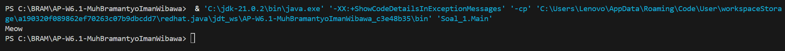
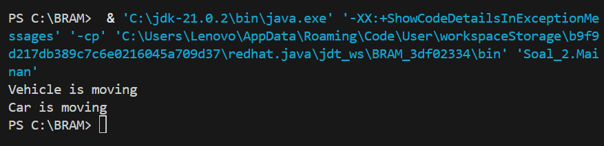

# AP-W6.1-MuhBramantyoImanWibawa

Karena Pada Code Di bawah ini;

Animal a = new Cat(); --> Disini Membuat objek Cat() lalu di simpan dalam Animal

a.sound(); --> lalu method sound panggil

jadi Compiler melihat tipe objek dari Animal dan memeriksa apakah method sound() ada di class Animal.

Karena pada polymorphism objek bisa memiliki banyak bentuk, dan method yang dipanggil ditentukan oleh bentuk asli objeknya, bukan oleh tipe variabel yang mereferensikannya.

v1.move(); --> Memanggil method move() dari class Vehicle

v2.move(); --> Memanggil method move() dari class Car turunan dari Vehicle yang sudah di override

Vehicle v1 = new Vehicle(); --> Objek Vehicle, reference Dari Vehicle

Vehicle v2 = new Car(); --> Objek Car, reference Dari Vehicle

Untuk v1.move():

v1 adalah reference bertipe Vehicle yang menunjuk ke objek Vehicle

saat di jalankan / diRun objeknya adalah Vehicle

Maka method move() yang dijalankan adalah milik class Vehicle

Untuk v2.move():
v2 adalah reference bertipe Vehicle yang menunjuk ke objek Car

Saat DiRun Compiler memeriksa apakah method move() ada di class Vehicle. Dan Java melihat objek nya adalah Car

Karena method move() di class Car sudah override, Java menjalankan versi Car